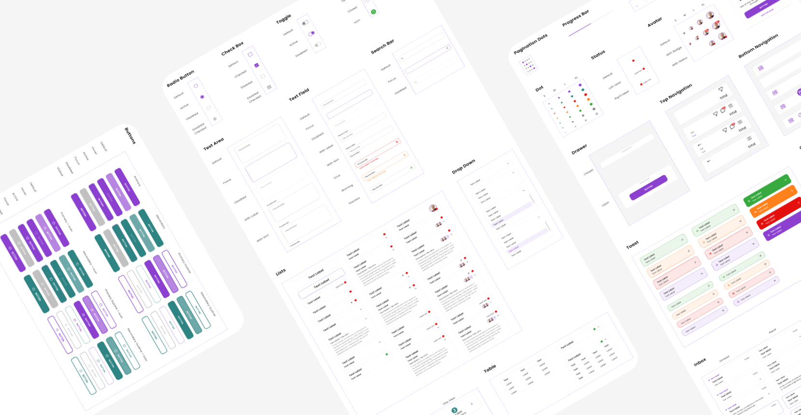

# @diconium/ui-toolbox - React UI Component Library

<a href="https://diconium.com/" target="_blank">
    
</a>

<div align="center" style="margin-block: 10px;">
<a href="https://docs.toolbox.diconium.com/" target="_blank" style="display: flex; align-items:center; justify-content:center;">
        
</a>
<br/>

<p><strong>@diconium/ui-toolbox</strong> is a common UI components library to build faster similar themed React web applications.</p>

[](https://choosealicense.com/licenses/apache-2.0/)

[](https://docs.toolbox.diconium.com/)

</div>

<a href="https://docs.toolbox.diconium.com/" target="_blank">
    
</a>

## Features

- **Customizable Components:** Each component in **@diconium/ui-toolbox** is designed to be highly customizable, allowing you to easily adapt the look and feel to match your application's design and branding.
- **Responsive and Mobile-Friendly:** **@diconium/ui-toolbox** components are built with responsiveness in mind, ensuring a seamless user experience across various devices and screen sizes.
- **Easy Integration:** Integrating **@diconium/ui-toolbox** components into your existing React project is a breeze. With simple import statements, you can start using the components right away.
- **Well-Documented:** We provide comprehensive documentation for each component, along with examples and usage guidelines to facilitate smooth integration.
- **Consistent Design Language:** **@diconium/ui-toolbox** components follow a consistent and coherent design language, promoting a polished and professional UI across your entire application.

## Installation

To install **@diconium/ui-toolbox** in your project, simply use npm:

```bash
npm install @diconium/ui-toolbox
```

## Linting

**@diconium/ui-toolbox** comes with a set of linting rules to maintain code consistency and readability. You can run the linting process using the following npm command:

```bash
npm run lint
// or
npm run lint:fix
```

## Usage

Using a component from **@diconium/ui-toolbox** is straightforward. Import the component you need and use it in your React application:

```jsx
import React from 'react';
import { Button } from '@diconium/ui-toolbox';

function App() {
  return <Button>Click me</Button>;
}
```

### Run storybook locally

```
npm run build:css:fonts
npm run build:css:watch
npm run storybook
```

### Build the library

```
npm run build:prod
```

### Component generators

If you want to create a new component you can call the following command on the terminal to create all the required files at once.

```
npm run generate:component <NAME OF NEW COMPONENT>
```

## Components

**@diconium/ui-toolbox** provides the following set of components:

- Avatar
- Avatars
- Button
- Primary
- Secondary
- Quick
- Sticky
- Radio
- Text
- Toggle
- Icon
- PaginationDots
- Tag
- Chip
- Checkbox
- TextField
- Searchbar
- Badge
- BadgeContainer
- State
- StateContainer
- TopNavigation
- Drawer
- NavigationBar
- Utils/Swipeable
- Dot
- Toast
- ProgressBar
- Spinner
- Layout/Mobile
- Layout/Centered
- Layout/Desktop
- Modal
- List
- ListItem
- TextArea
- Tooltip
- Calendar
- Message
- Select
- Tabs
- Table
- SideNavigation
- TestProvider

Please refer to the [documentation](https://docs.toolbox.diconium.com) for each component to learn more about their props, customization options, and examples of usage.

## Contribute

If you want to enhance the **@diconium/ui-toolbox**, you are welcome to fork the repository and create a pull request.
Please take into account, that we will have to conduct a code review before accepting your changes.

More details on how to best do that are described in our [Contributing guideline](https://github.com/DicoAuto/toolbox/blob/main/CONTRIBUTING.md).


## Contributors

<a href="https://github.com/robdembitel">
  
</a>
<a href="https://github.com/5041A">
  
</a>
<a href="https://github.com/umerfarooq-diconium">
  
</a>

## License

**@diconium/ui-toolbox** is released under the Apache License 2.0.

Happy coding!

© 2024 diconium GmbH. All rights reserved.
